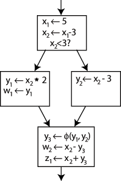

# MiniJava-Compiler


Implementation for the lesson Compiling Engineering (2020 Spring) in Peking University.

Adapted from [UCLA CS 132 Project](http://web.cs.ucla.edu/~palsberg/course/cs132/project.html).

Table of Contents:

- [MiniJava-Compiler](#minijava-compiler)
  * [Getting Started](#getting-started)
    + [Prerequisites](#prerequisites)
      - [Ubuntu 18.04](#ubuntu-1804)
    + [Build and Testing](#build-and-testing)
  * [Overview](#overview)
  * [Semantics Analysis](#semantics-analysis)
    + [Algorithm](#algorithm)
    + [Evaluation](#evaluation)
  * [IR Generation (1)](#ir-generation--1-)
    + [Algorithm](#algorithm-1)
    + [Evaluation](#evaluation-1)
  * [IR Generation (2)](#ir-generation--2-)
    + [Task Overview](#task-overview)
    + [_Spiglet_ Brief](#-spiglet--brief)
    + [Solution](#solution)
  * [Register Allocation](#register-allocation)
    + [Algorithm](#algorithm-2)
    + [Evaluation](#evaluation-2)
    + [Future Work](#future-work)
  * [Native Code Generation](#native-code-generation)
    + [System Call](#system-call)
    + [Stack Maintenance](#stack-maintenance)
  * [References](#references)

## Getting Started

### Prerequisites

- [spim](http://spimsimulator.sourceforge.net/): a self-contained simulator that runs MIPS32 programs
- *Java* JDK with version >= 11

#### Ubuntu 18.04

```bash
apt install -y spim default-jre default-jdk
```

### Build and Testing

That's easy! Just type these in your terminal:

```bash
./configure
make && make build
```

Type `make test` to run all tests. Type `make test -j<number of threads>` for multithreading.

## Overview

The works are divided into five parts, each of which is a homework of the course:

1. Semantics analysis: type check a MiniJava program
2. IR generation (1): compile a MiniJava program to Piglet
3. IR generation (2): compile a Piglet program to Spiglet
4. Register allocation: compile a Spiglet program to Kanga
5. Native code generation: compile a Kanga program to MIPS

Below are the tools used in this project. The binaries are under `/deps` folder.

- [JavaCC](https://javacc.github.io/javacc/): an open-source parser generator and lexical analyzer generator written in the Java
- [JTB](http://compilers.cs.ucla.edu/jtb/): a syntax tree builder to be used with JavaCC

-----------

## Semantics Analysis

### Algorithm

Because Java is a typed language, we should implement type checking for its subset (i.e., MiniJava).

For simplicity, we say that "type A matches with type B" if any one of the following conditions holds:

- A and B are the same type
- B is the superclass of A

Note that "A matches with B" does not imply "B matches with A".

The type checker should examinate each of the following type constrains:

- The type of a returned expression should match with the type of the method whose body contains the expression.
- The type of the right side of an assignment should match with the type of the left side.
- The type of the condition expression of a "if" statement or a "while" statement should be boolean.
- The types of comparison operants should be integer.
- A method should be invoked with a class type to which the method belongs.
- The type of method operants should match with the signature of that method.

The checker does the type checking in four passes:

1. Collect all the class names.
2. Infer the inheritance relations.
3. Collect all the methods and their signatures.
4. Traverse the AST to compute the type of each expression. In the same pass, the checker also check every type constrain.

Although MiniJava is a subset of Java, some programs that pass our typecheck can not pass the Java compiler because of the error "variable might not have been initialized". This is because Java has the rule to initialize the local variable before accessing or using them and this is checked at compile time, but our Minijava does not take such constrain into account. In this project, we choose to ignore that error. In fact, to detect uninitialized variable, we have to do the **control-flow analysis** (CFA), which is the major work of Part  4.

Our type structure is illustrated below.

- class Type
  - class PrimitiveType
    - class BoolType
    - class IntType
    - class ArrType
    - class VoidType
  - class ClassType
- class Method
- class StaticMethod

To check whether "type A matches with type B", we use the `typeCastCheck` function.

```java
class Type {
	static void typeCastCheck(final Type from, final Type to) {
		if (from instanceof PrimitiveType) {
			if (!from.getClass().equals(to.getClass())) {
				Info.panic("incompatible primitive type " + from + " -> " + to);
			}
		} else if (to instanceof PrimitiveType) {
			Info.panic("cast ClassType to PrimitiveType " + from + " -> " + to);
		} else {
			ClassType a = (ClassType) from;
			final ClassType b = (ClassType) to;
			while (a != null) {
				if (a.name.equals(b.name)) {
					return;
				}
				a = a.superclass;
			}
			Info.panic("cast to derived class failed " + from + " -> " + to);
		}
	}
}
```

### Evaluation

There are some corner cases that should be identified as `Type Error` when doing the semantics analysis. We are going to list them here.

1. Circular inheritance. With simple graph theory, we can check whether a loop in the directed inheritance graph using Depth First Search tree within $O(n)$ time, where the $n$ is the number of classes.
2. The overriding method has a different return type.
3. A temporary variable declared in a method body has the same name with one of the method argument names.

## IR Generation (1)

In the first part of the IR generation, we are going to translate Minijava into Piglet that is an IR with structured scoping, or tree-based instruction (while we will sonn see Spiglet is an IR without structured scoping). 

### Algorithm

The most interesting part is the memory layout. We now discuss the integer arrays and objects.

The memory representation of the code snippet below are shown in the figure. The variable is fundamentaly a pointer to a table. The first element of the table is the length of the array (in our example, the length is 4) and the others elements are the content of the array.

```java
int[] A = new int[4];
```


An instance of a class is also a pointer to a table. The first element of the table is another pointer to a vitrual table which is used for dynamically dispatch. The rest elements of the table are the field members of the instance.

```java
class Base {
  int x, y;
  int Bar() { ... }
  int Foo() { ... }
}
```


When inherited from a base class, a class simply adds new field members to the table and modifies the vitural table conforming to the overriding rule. In the figure below, the differences between the drived class and the base class are highlighted in blue.

```java
class Derived extends Base {
  int z;
  int Bar() { ... }
  int Fun() { ... }
}
```


When the number of arguments excceded 20, we have to find another way to pass the arguments because the Piglet interpreter support at most 20 arguments. Here is our solution. The first nineteen arguments are passed as usual, whereas others are stored in a new table. A pointer to the table is passed as the twentieth argument, as illustated in the figure.


### Evaluation

Beacuse Minijava and Piglet have similar structrue, we couple the IR generation design with semantic analysis for the coding convenience and readability. The code snippet below demonstrates our design.

```java
 /**
 * a.length
 * 
 * BEGIN HLOAD TEMP 1 a 0 RETURN TEMP 1 END
 **/
public Type visit(final ArrayLength n) {
	final String temp1 = e.newTemp();
	e.emitOpen("/* .length */", "HLOAD", temp1);
	final Type a = n.f0.accept(this);
	e.emitBuf("0");
	e.emitClose("RETURN", temp1, "END");
	if (a instanceof ArrType) {
		return new IntType();
	} else {
		Info.panic("ArrayLookup");
		return null;
	}
}
```

As we see, this method accomplishes two core tasks. First, we type check the variable that `.length` is applied to is of type `int[]`. Second, we generation the Piglet code to fetch the length field of the array.

Our implementation output detailed comment on the Piglet code. This yields better readability and is much easier to debug. Below is a sample output.

```
MAIN
	PRINT
		CALL BEGIN
			MOVE TEMP 201
			/*new Fac */ BEGIN
				MOVE TEMP 203 HALLOCATE 4
				MOVE TEMP 204 HALLOCATE 4
				HSTORE TEMP 203 0 TEMP 204
				HSTORE TEMP 204 0 Fac_ComputeFac
			RETURN TEMP 203 END
			MOVE TEMP 205 10
			HLOAD TEMP 202 TEMP 201 0
			HLOAD TEMP 202 TEMP 202 0
		RETURN TEMP 202 END (
			TEMP 201
			TEMP 205
		)
	/*PRINT*/
END
Fac_ComputeFac [ 2 ] BEGIN
	/* if */ CJUMP LT TEMP 1 1 L101
		MOVE TEMP 2 1
	/* else */ JUMP L102
		L101 MOVE TEMP 2 TIMES TEMP 1
		CALL BEGIN
			MOVE TEMP 206 TEMP 0 MOVE TEMP 208 MINUS TEMP 1 1
			HLOAD TEMP 207 TEMP 206 0
			HLOAD TEMP 207 TEMP 207 0
		RETURN TEMP 207 END (
			TEMP 206
			TEMP 208
		)
	/* endif */ L102 NOOP
RETURN
	TEMP 2
/* end Fac_ComputeFac */ END
```

## IR Generation (2)

### Task Overview

In this task, we are going to transfer _Piglet_ into _Spiglet_, which is a subset of _Piglet_. _Spiglet_ is closer to three address code since it eliminates recursive code from _Piglet_.

### _Spiglet_ Brief

The grammar for _Spiglet_ differs from that of _Piglet_ in the following ways:

-   The recursive expression is prohibited

-   There are only four types of expression `Exp`:
    -   Simple expression `SimpleExp`, which consists of temporary variable `Temp`, integer literal `IntegerLiteral`, and label `Label`.
    -   Function calling `Call`
    -   Memory allocation `HAllocate`
    -   Binary operation `BinOp`

-   Note that `StmtExp` is no longer an expression `Exp` in _Spiglet_. The main challenge in this task is to transfer `StmtExp` into a series of equivalent instructions.

-   Here we summarize all the BNFs that are different in *Piglet* and *Spiglet*:

    | Piglet                                                       | *Spiglet*                                             |
    | ------------------------------------------------------------ | ----------------------------------------------------- |
    | CJumpStmt ::= "CJUMP" Exp Label                              | CJumpStmt ::= "CJUMP" Temp Label                      |
    | HStoreStmt ::= "HSTORE" Exp IntegerLiteral Exp               | HStoreStmt ::= "HSTORE" Temp IntegerLiteral Exp       |
    | HLoadStmt := "HLOAD" Temp Exp IntegerLiteral                 | HLoadStmt := "HLOAD" Temp Temp IntegerLiteral         |
    | PrintStmt ::= "PRINT" Exp                                    | PrintStmt ::= "PRINT" SimpleExp                       |
    | Exp ::= StmtExp \| Call \| HAllocate \| BinOp \| Temp \| IntegerLiteral \| Label | Exp ::= Call \| HAllocate \| BinOp \| SimpleExp       |
    | StmtExp ::= "BEGIN" StmtList "RETURN" Exp "END"              | StmtExp ::= "BEGIN" StmtList "RETURN" SimpleExp "END" |
    | Call ::= "CALL" Exp "(" ( Exp )* ")"                         | Call ::= "CALL" SimpleExp "(" ( Temp )* ")"           |
    | HAllocate ::= "HALLOCATE" Exp                                | HAllocate ::= "HALLOCATE" SimpleExp                   |
    | BinOp ::= Operator Exp Exp                                   | BinOp ::= Operator Temp SimpleExp                     |
    |                                                              | SimpleExp ::= Temp \| IntegerLiteral \| Label         |
    From this chart, we can see only move statement `MoveStmt` can use expression `Exp` as a source. Printing statement `PrintStmt` uses simple expression `SimpleExp` as a source. Other statements use temporary variables for they resemble registers in the following section.

### Solution

Firstly, since we may use new temporary variables, we scan the whole program and find the next available temporary variable index.
	Secondly, we scan the whole abstract syntax tree again. In this pass, the main challenge is that at any node whose BNF consists of `Exp`, we should judge whether this `Exp` should be transform to `SimpleExp` or `TEMP`. If so, we should leverage `MOVE` statement to transfer the result of this `Exp` into newly added temporary variable, and the replace the this `Exp` in original statement by this new temporary variable. 

In our implementation, we scan the whole abstract tree in depth-first order. The difference from the common depth-first visitor is that, when visiting any node, a parameter is carried in to identify <u>the expected return token</u> of this node. Certainly, for some node types like Goal and `PrintStmt`, we don’t have expected return token. However, for other node types like `StmtExp`, we have an expected return token. 

To be specified, all the tokens are derived from an interface with method `ToString()`, which return the corresponding string form of the token. The classification of the expected token is the same as that of `Exp`. 

- Token
  - ExpToken
    - SimpleExpToken
      - TempToken
      - IntegerLiteralToken
      - LabelToken
    - CallToken
    - HAllocateToken
    - BinOpToken

```java
/**
 * Spiglet Token
 */
interface Token {
    public String toString();
}

class ExpToken implements Token {
}

class SimpleExpToken extends ExpToken {
}

class CallToken extends ExpToken {
    String tokenImage;

    CallToken(String tokenImage) {
        this.tokenImage = tokenImage;
    }

    public String toString() {
        return tokenImage;
    }
}

class HAllocateToken extends ExpToken {
    String tokenImage;

    HAllocateToken(String tokenImage) {
        this.tokenImage = tokenImage;
    }

    public String toString() {
        return tokenImage;
    }

}

class BinOpToken extends ExpToken {
    String tokenImage;

    BinOpToken(String tokenImage) {
        this.tokenImage = tokenImage;
    }

    public String toString() {
        return tokenImage;
    }
}

class TempToken extends SimpleExpToken {
    String tokenImage;

    TempToken() {
    }

    TempToken(String tokenImage) {
        this.tokenImage = tokenImage;
    }

    TempToken(Temp n) {
        this.tokenImage = "TEMP " + n.f1.f0.toString();
    }

    public String toString() {
        return tokenImage;
    }
}

class IntegerLiteralToken extends SimpleExpToken {
    int integerLiteral;

    IntegerLiteralToken(IntegerLiteral n) {
        this.integerLiteral = Integer.parseInt(n.f0.toString());
    }

    public String toString() {
        return Integer.toString(integerLiteral);
    }
}

class LabelToken extends SimpleExpToken {
    String label;

    LabelToken() {
    }

    LabelToken(String label) {
        this.label = label;
    }

    LabelToken(Label n) {
        this.label = n.f0.toString();
    }

    public String toString() {
        return label;
    }
}
```

Take `HLoadStmt` statement as an example. The BNFs of `HLoadStmt` in these two IR are:

- Piglet syntax `HLoadStmt ::= "HLOAD" Temp Exp IntegerLiteral `
- Spiglet syntax `HLoadStmt ::= "HLOAD" Temp Temp IntegerLiteral `

```java
/**
* Piglet syntax: HLoadStmt ::= "HLOAD" Temp Exp IntegerLiteral 
* Spiglet syntax: HLoadStmt ::= "HLOAD" Temp Temp IntegerLiteral
*/
public Token visit(HLoadStmt n, PigletTranslatorAugs argus) {
        Emitter e = argus.getEmitter();
        Token expectedToken = argus.getExpectedToken();
        if (expectedToken == null) {
            Token token1 = n.f1.accept(this, new PigletTranslatorAugs(e, new TempToken()));
            Token token2 = n.f2.accept(this, new PigletTranslatorAugs(e, new TempToken()));
            e.emitBuf(n.f0.toString(), token1.toString(), token2.toString(), n.f3.f0.toString());
            return null;
        }
        Info.panic("Never reach here!");
        return null;
    }
```

In above code snippet, `n` refers to current `HLoadStmt` Node in AST. We expect the `n.f1` to be an temporary variable, so we visit `n.f1` with parameters `new PigletTranslatorAugs(e, new TempToken())`. The same goes for `n.f2`.

```java
Token token1 = n.f1.accept(this, new PigletTranslatorAugs(e, new TempToken()));
Token token2 = n.f2.accept(this, new PigletTranslatorAugs(e, new TempToken()));
```

Then we call the `ToString()` method of the return token `token1` and `token2`, without knowing whether the corresponding subtree in AST is `Temp` or not. Note that the transfer have been emitted during the visit to the subtree. 

Let's see what happens when the expected return token is different from the current type. If current return token type is not derived from the expected return token type, we should adjust the current node through a series of instructions and return the expected token by the move statement. For example, when visiting `Hallocate` node,

```java
    public Token visit(HAllocate n, PigletTranslatorAugs argus) {
        Emitter e = argus.getEmitter();
        Token expectedToken = argus.getExpectedToken();
        Token token1 = n.f1.accept(this, new PigletTranslatorAugs(e, new SimpleExpToken()));
        StringBuffer buf = new StringBuffer();
        buf.append("HALLOCATE", token1.toString());
        if (expectedToken == null) {
            e.emit(buf.toString());
            return null;
        } else if (expectedToken.getClass().isAssignableFrom(HAllocateToken.class)) {
            return new HAllocateToken(buf.toString());
        } else {
            /**
             * MOVE TEMP 1 HALLOCATE SimpleExp
             */
            Token rv = new TempToken(e.newTemp());
            buf.prepend(rv.toString());
            buf.prepend("MOVE");
            e.emit(buf.toString());
            return rv;
        }
    }
```

- If no expected return token, return `null`:

  ```java
  if (expectedToken == null) {
              e.emit(buf.toString());
              return null;
          }
  ```

- if the expected return token is derived from `HallocateToken`, return `HallocateToken` directly.

  ```java
   else if (expectedToken.getClass().isAssignableFrom(HAllocateToken.class)) {
              return new HAllocateToken(buf.toString());
   }
  ```
  
- Otherwise, we leverage `MOVE` statement to transfer the result of this `Exp` into newly added temporary variable, and return the this newly added temporary variable.

    ```java
    else {
                /**
                 * MOVE TEMP 1 CAll SimpleExp (...)
                 */
                Token rv = new TempToken(e.newTemp());
                buf.prepend(rv.toString());
                buf.prepend("MOVE");
                e.emit(buf.toString());
                return rv;
            }
    ```


Since we visit the AST in depth first order, as for recursive statement, we will emit its internal statement firstly during on-the-fly translation.

## Register Allocation

_Register allocation_ is one of the most fundamental problems in compiler design. This is because every machine has a finite (usually **scarce**) number of registers to hold the temporal variables in the IR code. Therefore, if there are one or more temporal variables that can be assigned a machine register, we have to _spill_ some of temporaries in memory instead of registers. 

It is not an easy task to minimize the number of temporaries that have to be spilled. The difficulty rises from the fact that this job is a NPC problem. To see why, consider a _register interference graph_ (RIG) in which each node represents a temporary value and each edge ($t_1$, $t_2$) indicates a pair of temporaries that cannot be assigned to the save register. Our challenge is to color all these nodes with $K$ colors, where $K$ is the number of available registers on the machine. The graph coloring problem appears as a NP-complete problem.

Generally, _linear scan_ and _second-chance bin packing_ are two popular approaches that widely used in practice. The major advantage is simplicity. It runs in linear time  and produce good code in many circumstances (e.g., JIT compilers like Java HotSpot). Unfortunately, these methods trade some performance for simplicity and efficiency. 

The Chaitin's Algorithm, a method based on RIG, outperforms linear scan and second-chance bin packing. It is used in production compilers like GCC. Although this algorithm a based on the NP-hard graph coloring problem, it produces excellent assignment of variables to registers. It intelligently and heuristically gives an approximation to the NPC problem.

In the lab, we are going to implement a variant of Chaitin's Algorithm for the translation form Spiglet language to Kanga language. In the example testcases, our implementation *always* produces shorter and cleaner code than the example output. 

### Algorithm

Most of our implementation design aspects follow what is described in _Modern Compiler Implementation in Java (2nd edition)_. The main phases are shown in the figure below.


**Build:** First we have to do the liveness analysis. We takes each instruction as a basic block and solve the following equations:

$$
\begin{align*}
in[n] &= use[n] \cup (out[n] - def[n]) \\
out[n] &= \bigcup_{s \in succ[n]} in[s]
\end{align*}
$$

Then we build the RIG. Add an edge for two temporaries if they are in the same $in[n]$ or $out[n]$ for some $n$. Notice that if a temporary is defined but not used, it will not appear in any $out[n]$ or $in[n]$, and thus we may mistakenly think it does not interfere with other temporaries. To solve this problem, we simply remove the instruction that defines this unused temporary. The correctness is obvious because that instruction is a kind of dead code and _dead code elimination_ (DCE) does not affect the program results.

One the flip side, we must takes pre-allocated registers (a.k.a pre-colored nodes) into consideration. There are two rules for these registers. First, pre-allocated registers interfere with each other. Second, temporaries that live across a function call interfere with all caller-saved registers. Below is the code snippet.

```java
// pre-allocated registers
for (int i = 0; i < TempReg.NUM_REG; i++) {
  for (int j = i + 1; j < TempReg.NUM_REG; j++) {
    TempReg ri = TempReg.getSpecial(i);
    TempReg rj = TempReg.getSpecial(j);
    rig.addInterference(ri, rj);
  }
}

// caller-saved registers
for (Instruction i = dummyFirst.next; i != dummyLast; i = i.next) {
  if (i instanceof InstrCall) {
    for (TempReg r : i.in) {
      if (i.out.contains(r) && !i.def.contains(r)) {
        for (int j = TempReg.CALLEE_SAVED_REG; j < TempReg.NUM_REG; j++) {
          rig.addInterference(r, TempReg.getSpecial(j));
        }
      }
    }
  }
}
```

In addition, we leverage the algorithm to save the callee-save registers intelligently by moving a callee-save register to a fresh temporary. If there is *register pressure* in a function, the temporary will spill; otherwise it will be coalesced with the corresponding callee-save register and the MOVE instructions will be eliminated by the procedure that we will soon introduce.

```
FOO [2][0][0]
MOVE TEMP 1 s0
MOVE TEMP 2 s1
MOVE TEMP 3 s2
... // the body of the function
MOVE s2 TEMP 3
MOVE s1 TEMP 2
MOVE s0 TEMP 1
```

**Simplify**: Remove the nodes that is less than $K$ degrees (Here, $K=24$ because MIPS machine has 24 registers) and that is non-move-related. We say a node "move-related"  when the corresponding temporary is used in the instruction `MOVE r1 r2` (`r1` and `r2` are registers).

**Coalesce**: Coalescing means merge two nodes into a new node whose edges are the union of those of the nodes being replaced. This approach is important for eliminating move instructions. We wish to coalesce only where it is safe to do so, that is, where the coalescing will not render the graph uncolorable. Both of the following strategies are safe:

- Briggs: Nodes `a` and `b` can be coalesced if the resulting node `ab` will have fewer than $K$ neighbors.
- George: Nodes `a` and `b` can be coalesced if, for every neighbor `t` of `a`, either `t` already interferes with `b`.

To maintain the coalescing relation, we resort to _disjoint set union_ (DSU) that is a data structure tracking a set of elements partitioned into a number of disjoint (non-overlapping) subsets. Here the "elements" are all the original nodes and the "disjoint subset" is the union of the coalesced nodes. We use the field `alias` to represent "the parent" of a subset.

```java
	static class MoveRelated {
		Node n1, n2;

		MoveRelated(Node n1, Node n2) {
			this.n1 = n1;
			this.n2 = n2;
		}
    
		void update() {
			while (n1.alias != null) {
				n1 = n1.alias;
			}
			while (n2.alias != null) {
				n2 = n2.alias;
			}
		}
	}
```

**Freeze**: give up hope of coalescing a move and "simplify" may continue.

**Spill:** select a node for potential spilling and push it on the stack.

**Select:** Pop the entire stack, assigning colors.

**Actual Spill**: If we cannot assign a color to node `n`, we rewrite the program to spill the corresponding temporary. First, we spare a new address for store/fetch the temporary. Second, add store it on the stack after it is defined and fetch it before it is used by an expression. Below is an example:

```
MOVE TEMP 1 ADD TEMP 2 TEMP 1
```

After `TEMP 1` is spilled (assume we use a brand new temporary `TEMP 5` for this spilling and the memory address is `SPILLEDARG 10`):

```
ALOAD TEMP 5 SPILLEDARG 10
MOVE TEMP5 ADD TEMP2 TEMP 5
ASTORE SPILLEDARG 10 TEMP 5
```

### Evaluation

In the example testcases, our implementation *always* produces shorter and cleaner code than the example output. This mainly thanks to the coalescing operation. For code,

```
Tree_SetRight [2]
BEGIN
       HSTORE TEMP 0 8 TEMP 1
       MOVE TEMP 446 1
RETURN
       TEMP 446
END
```

the example gives:

```
Tree_SetRight [2][2][0]
       ASTORE SPILLEDARG 0 s0
       ASTORE SPILLEDARG 1 s1
       MOVE s0 a0
       MOVE s1 a1
       HSTORE s0 8 s1
       MOVE t0 1
       MOVE v0 t0
       ALOAD s0 SPILLEDARG 0
       ALOAD s1 SPILLEDARG 1
END
```

ours yields code:

```
Tree_SetRight [2] [0] [0] 
	HSTORE a0 8 a1
	MOVE v0 1 
END 
```

We can see that our algorithm efficiently uses the valuable registers.

### Future Work

**Label Rewrite**: Rewrite the code

```
JUMP L2
...
JUMP L1
...
L2 NOOP
L1 NOOP
```

as

```
JUMP L3
...
JUMP L3
...
L3 NOOP
```

**Static Single-Assignment (SSA)** form: Rewrite the program so that each variable has only one definition in the program text. 

> 
>
> It is clear which definition each use is referring to, except for one case: both uses of y in the bottom block could be referring to either y1 or y2, depending on which path the control flow took.
>
> To resolve this, a special statement is inserted in the last block, called a $\phi$ _function_. This statement will generate a new definition of *y* called y3 by "choosing" either y1 or y2, depending on the control flow in the past. (Wikipedia)

**Heuristic Spilling**: Our implementation spill the first node that can be colored. In fact, we can select the node to be spilled in a heuristic manner. That is, we first calculate spill priorities and spill the node with lowest priorities. The priority can be defined as
$$
\frac {\text{uses outsides loop}+\text{uses insides loop} \times 10} {\text{Degree}}
$$

The priority value represents the gained performance if we don't spill this node.

## Native Code Generation

In this task, we are going to transfer IR representation *Kanga* into assembly language *MIPS*. There are two main challenges in this task: system call(`HALLOCATE`, `PRINT`, `ERROR`)and stack maintenance. We will explain the respective solutions towards these challenges in the following sections.

### System Call

There are three types of instructions in *Kanga* that must be implemented by system call, namely heap memory allocation `HALLOCATE`, printing instruction `PRINT` and error instruction `ERROR`. Generally, the function number and the parameter of the system call are specified by register `v0` and `a0` respectively. Meanwhile, the return value is stored in register `v0` if any. 

| Function             | Function Number `v0` | Parameter                                        | Return Value                             |
| -------------------- | -------------------- | ------------------------------------------------ | ---------------------------------------- |
| Print Integer        | 1                    | `a0` = integer to be printed                     | N/A                                      |
| Print String         | 4                    | `a0` = first address of the string to be printed | N/A                                      |
| Allocate Heap Memory | 9                    | `a0` = number of bytes to be allocated           | `v0` = first address of allocated memory |
| Exit                 | 10                   | N/A                                              | N/A                                      |

In our implementation, these system calls are wrapped into procedures:

```assembly
	.text 
	.globl _halloc 
_halloc : 
	li $v0, 9 
	syscall 
	j $ra 

 
	.text 
	.globl _print 
_print : 
	li $v0, 1 
	syscall 
	la $a0, newl 
	li $v0, 4 
	syscall 
	j $ra 

 
	.text 
	.globl _error 
_error : 
	la $a0, str_er 
	li $v0, 4 
	syscall 
	li $v0, 10 
	syscall 

 
	.data 
	.align   0 
newl : 
	.asciiz "\n" 

 
	.data 
	.align   0 
str_er : 
	.asciiz " ERROR: abnormal termination\n" 
```

### Stack Maintenance

The layout of stack frame is:


Note that when a procedure is called, its number of spilled parameters is still unknown. Therefore, for the convenience of generating code, the spilled parameters is stored in reversed order.

Take the procedure `Fac_ComputeFac [2][3][2]` as an example, when entering this procedure:

```assembly
	.text 
	.globl Fac_ComputeFac 
Fac_ComputeFac : 
	sw $fp, -8($sp) 
	move $fp, $sp 
	subu $sp, $sp, 20 
	sw $ra, -4($fp) 
```

When leaving this procedure:

```assembly
	lw $ra, -4($fp) 
	lw $fp, 12($sp) 
	addu $sp, $sp, 20 
	j $ra 
```

-------

## References

- [Gettysburg CS 374](http://cs.gettysburg.edu/~tneller/cs374/)
- [Software and Documentation](http://compilers.cs.ucla.edu/cs132/setup.html)
- [Standford cs143](https://web.stanford.edu/class/archive/cs/cs143/cs143.1128/lectures/17/Slides17.pdf)
- _Modern Compiler Implementation in Java (2nd edition)_
